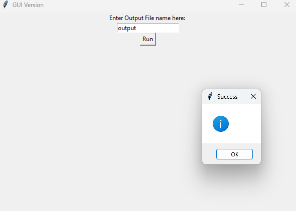

# Excel Files Merger

## Screenshot

A Python automation tool that merges multiple Excel files into one.

## Features
- Merges multiple Excel files from a folder
- Adds Source File column to track data origin
- Creates Summary Sheet with grouped sales data
- Professional formatting with openpyxl
- Simple GUI with tkinter

### How to Use
1. Add Excel files to `excel_files` folder
2. Run `gui.py`
3. Enter output file name
4. Click Run!

## Technologies
- Python
- Pandas
- openpyxl
- tkinter